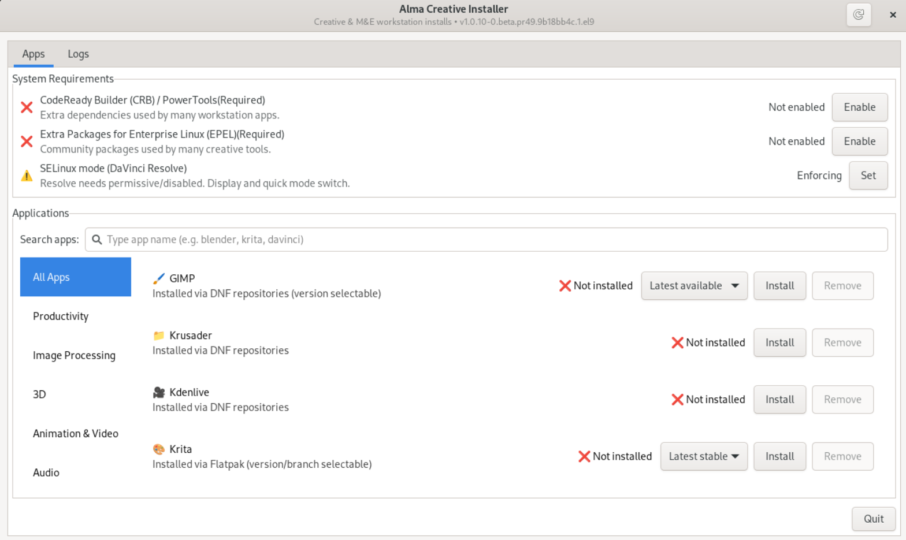
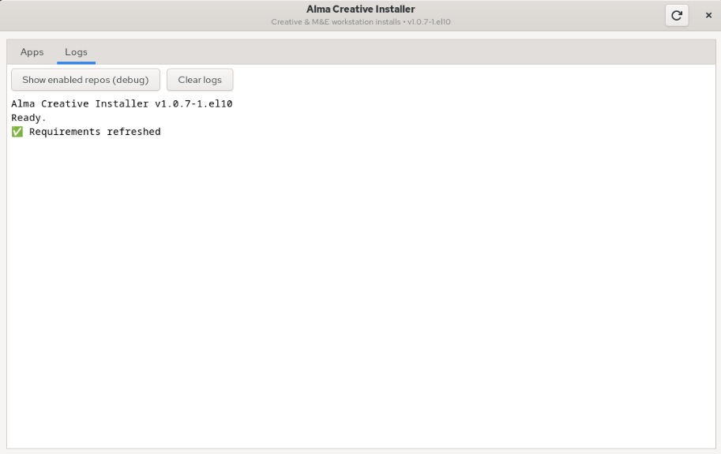

# 🎨 AlmaLinux Creative Installer

A small, opinionated GTK application for AlmaLinux that delivers **one-button installs**
for creative and Media & Entertainment (M&E) workstation software — without the usual
dependency headaches.

All software is installed using **supported system methods** only.

*Main window showing system requirements, install status, and guided workflows.*

*Logs window showing the live log while installing, removing apps / repos. Able to show enabled repos for debug and clear log in that window with button*

---

## 🚀 Quick Start (Recommended)

### 1️⃣ Download the RPM

Go to the GitHub Releases page:

https://github.com/KernelChief/almalinux-creative-installer/releases

Download **one RPM file** that matches your AlmaLinux version.

You will see files named like:

- almalinux-creative-installer-1.0.1-1.el9.noarch.rpm
- almalinux-creative-installer-1.0.1-1.el10.noarch.rpm

### 📌 Understanding the version number (X.X.X-X)

Example filename:

almalinux-creative-installer-1.0.1-1.el9.noarch.rpm

- 1.0.1 → application version  
- -1 → RPM release number  

Whenever this README refers to `X.X.X-X`, **replace it with the exact version shown in the filename you downloaded**.

Example:

If the filename is  
almalinux-creative-installer-1.0.1-1.el9.noarch.rpm  

Then:

- X.X.X-X = 1.0.1-1

---

### 2️⃣ Install the RPM

Open a terminal and change to the directory where the RPM was downloaded.

Run the command below, **replacing X.X.X-X with your version number**:

From the directory where you downloaded the file:

`sudo dnf install ./almalinux-creative-installer-X.X.X-X.rpm`

Example for AlmaLinux 9: sudo dnf install ./almalinux-creative-installer-1.0.1-1.el9.noarch.rpm

Example for AlmaLinux 10 (experimental): sudo dnf install ./almalinux-creative-installer-1.0.1-1.el10.noarch.rpm

This will:
- install the application
- register the polkit helper
- add a desktop entry

---

### 3️⃣ Launch the Application

The application itself runs **unprivileged**.

When a system change is required (installing or removing software, enabling repositories),
you will be prompted for authentication via **polkit**.

Polkit may temporarily cache authentication to avoid repeated prompts.
Once the application is closed, the authorization is discarded.

You can launch the application:

- From your desktop environment’s application menu:
  `AlmaLinux Creative Installer`
- Or from a terminal: 
  `almalinux-creative-installer`

---

## 📦 Installation Methods of softwares via the AlmaLinux Creative Installer

AlmaLinux Creative Installer uses the following approaches, depending on the software:

- DNF packages from system repositories
- Local RPM installers
- Local .run installers (vendor-distributed software)
- Flatpak is avoided, except when upstream strongly recommends it on EL
  (currently: Krita)

---

## 🧩 Supported Platforms

- AlmaLinux 9 — officially supported
- AlmaLinux 10 — experimental

Some creative applications are not yet available (or not yet complete) in AlmaLinux 10 /
EPEL repositories at this time (for example: Blender and GIMP availability varies),
so results may differ.

---

## 🎬 Target Applications

This project focuses on real-world creative tools commonly used in studios,
post-production, and content creation environments:

- GIMP
- Krita (Flatpak workflow, upstream-recommended on EL)
- Blender
- DaVinci Resolve

Additional applications may be added as the project evolves.

---

## 🎞️ DaVinci Resolve: Guided Install Flow

DaVinci Resolve follows a guided workflow designed for AlmaLinux:

1. If SELinux is enforcing, prompt to set it to **permissive** or **disabled** (permanent).  
   A reboot is required for the change to fully apply before launching Resolve.
2. Pre-install required system dependencies (prompts for privileges if needed).
3. Open the official Blackmagic Design download page.
4. Unzip the downloaded DaVinci Resolve archive (the file picker won’t see it otherwise).
5. Prompt the user to select the installer (`.run` or `.rpm`).
6. Run the installer:
   - `.run` is executed as the **normal user** (vendor requirement).
   - `.rpm` is installed with elevated privileges.

Uninstalling Resolve runs the vendor uninstaller at `/opt/resolve/installer`
and must also be run as a normal user.

---

## 🔐 Privilege & Security Model

- The graphical application runs **unprivileged**
- All system-modifying actions run via **polkit-protected helpers**
- Authentication is requested **only when required**
- Vendor `.run` installers and uninstallers are executed as the **normal user**

This keeps the UI safe, auditable, and aligned with system security best practices.

---

## 🛡️ Security & Quality

This repository follows basic security and code-quality best practices:

- **Dependabot** monitors dependencies and surfaces known vulnerabilities
- Code quality is reviewed during development using SonarQube-compatible static analysis tools (SonarLint)

These tools are advisory and do not imply certification or formal auditing.

---

## 🧹 Uninstalling the Application

To remove the application, run:

`sudo dnf remove almalinux-creative-installer`

---

---

## ❓ FAQ

**Why does DaVinci Resolve require SELinux permissive or disabled?**  
Resolve’s vendor installer and runtime expect permissive/disabled on EL.
The installer will prompt to set this **permanently** before continuing.

**Why does the SELinux prompt sometimes not appear?**  
If SELinux is already **permissive** or **disabled**, the prompt is skipped.
Check with `getenforce`.

**I rebooted and SELinux is still permissive. Why?**  
Check `/etc/selinux/config`. If it contains an invalid value like
`SELINUX=enforced`, the system falls back to permissive. Valid values are
`enforcing`, `permissive`, or `disabled`.

**Why does the Resolve `.run` installer/uninstaller run as a normal user?**  
Blackmagic’s installer explicitly refuses to run as root. The UI enforces this.

**Why is Krita installed via Flatpak?**  
Krita’s upstream recommends Flatpak for Enterprise Linux to ensure current
features and dependencies that may lag in EL repositories.

**Where is the Resolve uninstaller?**  
It is located at `/opt/resolve/installer` and must be run as a normal user.

**Why doesn’t the Resolve installer show in the file picker?**  
You must **unzip/extract** the downloaded archive first.

**Can I re-enable SELinux enforcing after uninstalling Resolve?**  
Yes. The UI prompts to restore enforcing after a successful uninstall.

---

## 🧰 Troubleshooting

**The Resolve installer/uninstaller won’t run over SSH.**  
Resolve’s `.run` uses interactive UI prompts. Run the installer from a graphical
desktop session as a normal user.

**The app shows old behavior after I updated the source.**  
The UI calls the installed helper at `/usr/libexec/almalinux-creative-installer-helper`.
If you’re running from source, make sure the system package is updated too.

**Flathub was added to my system. Is that expected?**  
Yes. Krita is installed via Flatpak, and the installer adds Flathub system‑wide
to enable it.

**The RPM build script fails.**  
`build-rpm.sh` uses the **latest git tag** for the version. Create a tag like
`v1.0.5` before building.

---

## 📜 License

This project is licensed under the **GNU General Public License v3.0 (GPLv3)**.

This means:
- You are free to use, modify, and distribute this software
- Any redistributed or modified versions **must remain GPLv3**
- Source code must be made available when distributing binaries

See the `LICENSE` file for full terms.

